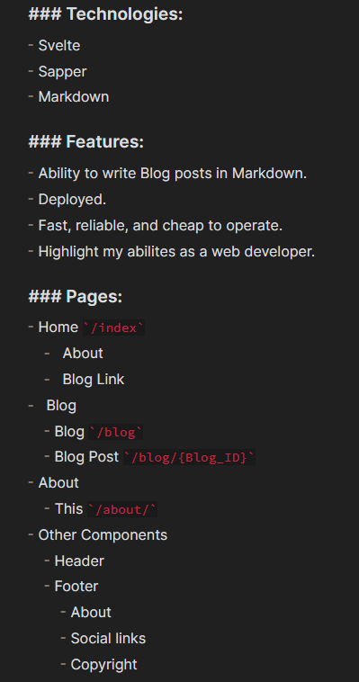

Svelte has been gaining momentum recently and offers solutions to some of the complaints with React. I've been meaning to create a personal site to show off my work and to publish my ideas for a while now, and after reading a few posts from other developers about Sapper, I decided to give it another shot.

## 💡 First thing's first. Start with the ideas.

I started out by writing some notes. I like to create an "outline" of the project before I begin to organize my ideas and define the project scope. This outline will continue to change as the project progresses.



I also designed my blog page in Figma to give myself the opportunity to play with my ideas and give the project a more concrete vision. Design, in general, has always intreagued me and is something I want to improve upon. Making great things comes with practice and experience, so I took this step serirously. I first sketched out some ideas in my notebook, and then flushed them out inFigma. After this, I implemented the design in good old HTML and CSS so that I could write clean code without the hurdle of learning a new javascript framework.

At this point I now have a clear vision for what I want my site to look like, the types of information that may go on it, and a starting set of features to develop.

## 🏞️ Second thing's second. Build the development envrionment.

This part is always a mix of emotions. It's exciting because you get to finally start playing around with fancy new tools. But it's also nerve-racking because you have no clue how to use these tools.

1. I followed the [Sapper Getting Started] (https://sapper.svelte.dev/docs#Getting_started) guide to scaffold my application.
2. Installing the Svelte extension.
3. Explored the [folder structure](https://sapper.svelte.dev/docs#Sapper_app_structure).
4. Now here I would like to say I spent some time reading and understanding the documentation but honestly I do not have the attention span for that so I jumped right in and began looking up tutorials and other examples of what I want to build.

## 🏗️ Packages and Tools

- [Date-fns](https://date-fns.org/)
  - Take it or leave it, but I am using a date formatter for because I might want to change the date format later.
- [Gray-matter](https://github.com/jonschlinkert/gray-matter)
  - Manages the YAML at the top of my markdown blog posts.
- [Marked](https://marked.js.org/)
  - Processes the markdown into html.
- [Shiki](https://shiki.matsu.io/)
  - Syntax highlighter, this one uses the VSCode renderer and its all fancy and stuff ✨.

## Building the blog (A few key points)

### Translating markdown into svelte.

There a few differnt methods used the translate markdown into svelte. At first I was excited about MDsvX (a MDX svelte port) but its use cases ended up clashing with how I was intending to use markdown as content. I finally settled on Gray-matter, used to decode metadata from the markdown file, and marked, a markdown converter to render the markdown as html.

### Lising the blog posts.

This gave me a little trouble, mostly because I did not understand how sapper merges dynamic and static information. I will now try my best to regurgate what I learned.

#### The Sapper 'backend' and 'frontend'

The mental model I developed to understand this is that each page in sapper can have two files: `index.svelte` (the frontend) and `index.json.js` (the backend), for example. The timing, location (server vs client), and order of processing these pages is not intuitive but just know it's optimized and works wonderfully.

##### The 'backend' (`.json.js`)

These files are written entriely in javascript and will return a JSON response. This is where any dynamic information will get processed. So in the case of our `/blog` route, the `/routes/blog/index.json.js` file needs to read through a folder of content, extract the metadata (title, date, etc.), and return that in a JSON list.

```javascript
import fs from "fs";
import path from "path";
import grayMatter from "gray-matter";

import { CONTENT_PATH } from "../../config"; // "content/blog"

// Map across "content/blog" folder and create a list of the metadata from the index.md files.
const posts = fs.readdirSync(CONTENT_PATH).map((file) => {
  const post = fs.readFileSync(
    path.resolve(CONTENT_PATH, `${file}/index.md`),
    "utf-8"
  );
  return grayMatter(post).data; // exract the metadata
});

// Return the posts reversed (so newest post is a the top of the page)
export function get(req, res) {
  res.writeHead(200, {
    "Content-Type": "application/json",
  });
  res.end(JSON.stringify(posts.reverse()));
}
```

##### The frontend (`.svelte`)

These are svelte files. They do all the reactive svelte front end stuff, contain the html and css, and ultimatly display our information. So, for this example, we have the `/routes/blog/index.svelte` file. In addition to the normal html and css, we also need to include some code to retreive the list of blogs and their data from the `json` file. We do this simply by fetching at the `blog.json` endpoint (representing the file `/routes/blog/index.json.js`). Don't forget to create a [prop for the list of posts](https://svelte.dev/docs#1_export_creates_a_component_prop) so we can use it as normal.

```html
<!-- 
  /blog 
-->

<script context="module">
  export async function preload() {
    const res = await this.fetch(`blog.json`);
    const data = await res.json();

    if (res.status === 200) {
      return { posts: data };
    }
    this.error(res.status, data.message);
  }
</script>

<script>
  export let posts;
</script>
```

Now we can simply use the `posts` object as we created it in the JSON file.

```html
<ul>
  {#each posts as post}
  <li><a rel="prefetch" href="blog/{post.slug}">{post.title}</a></li>
  {/each}
</ul>
```

### 3) Syntax highlighting.

Honestly, after choosing my technologies (I know highlightjs is a popular one) this was fairly straight forward. Attaching the code snipit because it was kind of tricky to combine examples from the various documentations.

```javascript
// [slug].json.js
 shiki.getHighlighter({
   theme: 'material-theme-darker'
 }).then(highlighter \=> {
   const renderer \= {
     code(code, infostring) {
       return highlighter.codeToHtml(code, infostring);
     }
   }
   marked.use({renderer});
 });
```

## Useful links

- https://www.swyx.io/about/
- https://www.codingwithjesse.com/blog/statically-generating-a-blog-with-svelte-sapper/
- https://www.mahmoudashraf.dev/blog/build-a-blog-with-svelte-and-markdown/
- https://www.ryanfiller.com/blog/a-deep-dive-into-sapper/
